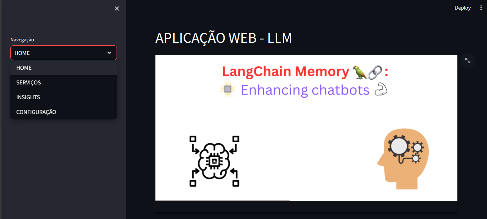
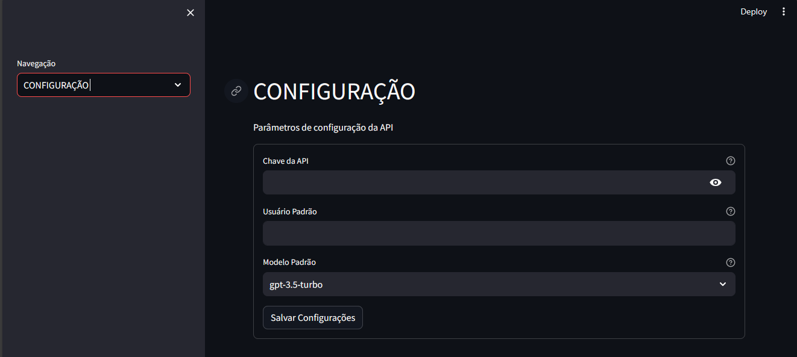

<<<<<<< HEAD

=======
## CRIAR MODELO PARA PROJETOS FUTUROS DE LLM

- Esta imagem abaixo do texto, é  um padrão de projetos é uma forma que eu pensei em me organizar para futuramete meus projetos mais organizados possiveis, e també é uma forma de eu desenvolver-me técnicamente, desta forma consigo mensurar minhas divídas técnicas para reconhecer as lacunas que ainda tenho, e tudo isto começa por uma organização básica nos meus projetos de autodesenvolvimento e na construção de aplicação que traga um reflexo de melhorias  continuas e também constancias na busca pelo crescimento diário.

  

>>>>>>> 6f8e22aecd9b0176735d100667d2ad3deafac6f5
